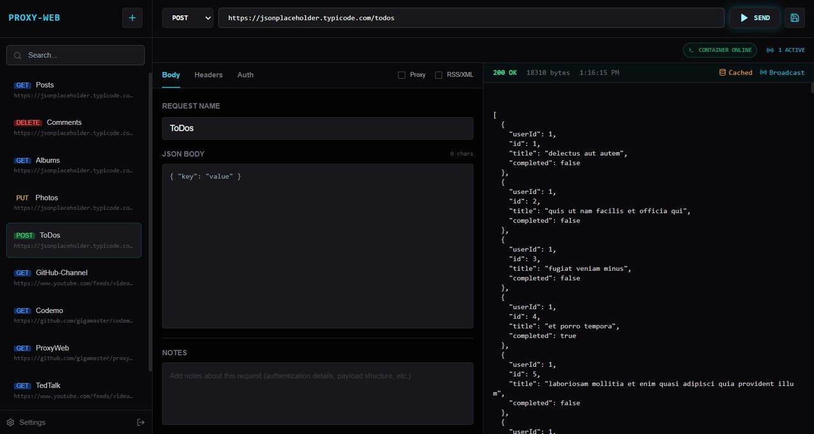
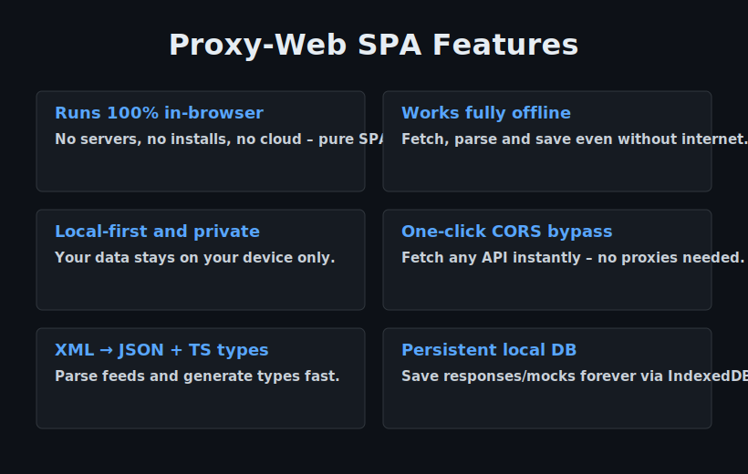

<h1 style="text-align:center;font-size:5em" align="center">
    <picture align="center">
    
    </picture>
    <br>
    Proxy-Web
</h1>

<picture>
  
</picture>

**Proxy-Web** is a secure, offline-first HTTP client designed for the digital nomad workflow. It is built to run on local hardware: Mini-PCs, and travel laptops without reliance on cloud sync, external CDNs, or heavy container runtimes.

<picture>
  
</picture>


<picture align="center">

</picture>

<picture>
  
</picture>

<p align="center">

</p>


## Concept and Benefits of an In-Browser SPA Proxy

An **SPA proxy** (Single-Page Application proxy) implemented entirely in the browser gives your web app powerful networking capabilities without any server-side component. Here are the main advantages:

### 1. Bypasses CORS Restrictions Effortlessly
- Fetch data from almost any API or resource that would normally be blocked by browser CORS policy
- No need for server-side proxies, browser extensions, or API provider CORS configuration
- Ideal when dealing with legacy APIs, third-party feeds, or restricted endpoints

### 2. True Offline & Local-First Operation
- After the initial page load, the proxy logic runs even without internet
- Cache responses, mock APIs, parse data, and save to IndexedDB.
- Perfect for offline:
  - Flights and travel
  - Rural and low-connectivity areas
  - Internet outages or cloud service blackouts

### 3. Zero Server Dependency
- No backend hosting, deployment, scaling, or maintenance costs
- The entire application (proxy included) is a static SPA, self-hosted or host on GitHub Pages, Netlify, Vercel
- Maximum digital sovereignty and independence

### 4. Stronger Privacy & Data Control
- Requests never leave the user's device (unless explicitly shared)
- No third-party proxy server sees your traffic or data
- You can locally sanitize, filter, or transform responses before using them

### 5. Super-Fast Offline Development & Testing
- Mock API endpoints directly in the browser
- Record real responses, save, replay offline
- Build and debug features when external APIs are down, rate-limited, or unavailable
- No need for external tools like Postman, Mockoon, or Mirage JS

### 6. Instant Responsiveness
- Proxy runs in the same JavaScript context, zero-latency
- Combine with cache, offline-first becomes even more powerful
- Feels snappier than traditional server-mediated proxies

### 7. Ultimate Portability
- One HTML/JS file can contain full proxy functionality
- Share via email, USB, QR code, or static link
- Run in restricted environments (corporate networks, air-gapped systems, etc.)
- Broadcast your data with safe tokens.

### 8. Local API mocking  
  Create & test against fake endpoints directly in your browser – ideal for offline dev.

- **Broadcast cached data via secure endpoint**  
  Generate a temporary or token-protected URL endpoint in seconds.  
  Anyone with the link + token can request your cached responses (JSON/XML) without exposing your full app or local storage.  
  Perfect for quick sharing, team collaboration, demos, or feeding data to other tools/scripts — all while keeping control and privacy.
- **Digital sovereignty & nomad-ready**  
  Self-contained, self-hostable, no vendor lock-in – perfect for independent developers.

<picture>
  
</picture>

### Trade-offs to Consider

While Proxy-Web delivers powerful in-browser proxying with strong offline and sovereignty features, there are some inherent limitations and risks to keep in mind:

- **Requests requiring server-side secrets** (e.g., cookies, auth tokens, API keys) must be handled carefully
- **Encrypted local database – password / key loss means permanent data loss**  
  Cached responses and stored data in IndexedDB are encrypted for privacy and sovereignty. If you forget your encryption password (or lose your hardware key for exports), the data becomes irrecoverable. There is no backdoor or recovery mechanism by design.
- **Tunnel Mode relies on third-party infrastructure**  
  In Tunnel Mode, API requests route through StackBlitz's cloud-based WebContainer tunnel (Netherlands-hosted). This provides instant setup and CORS bypass but introduces:
  - Dependency on internet + StackBlitz availability
  - Trust in a third party (data passes through their service)
  - Commercial licensing restrictions for high-volume/for-profit use (>10,000 API requests/month)
- **Initial bundle size is reasonable but non-trivial**  
  The SPA includes WebContainer runtime + advanced features (XML/JSON parsing, type generation, IndexedDB storage, offline caching). It remains much lighter than full Electron apps or heavy container tools (no Podman, Docker overhead, or virtual machine), but first-load time may be longer than a minimal static page, especially on slow networks.
- **Offline / LAN Mode requires prior caching**  
  Full offline operation (no external requests, or tunnel) only works for previously cached responses.

In exchange for these trade-offs, Proxy-Web offers **true zero-server deployment**, **radical offline resilience**, and **maximum user control** over data flows, making it especially valuable for digital nomads, privacy-conscious developers, and low-connectivity environments.


### In summary

An in-browser SPA proxy turns the browser into a **self-contained, private, offline-capable network client** — liberating developers from server infrastructure while enabling new use-cases around resilience, privacy, and portability.


<picture>
  
</picture>

## License

**MIT License**

Copyright (c) 2026 Nuno Luciano

Permission is hereby granted, free of charge, to any person obtaining a copy  
of this software and associated documentation files (the "Software"), to deal  
in the Software without restriction, including without limitation the rights  
to use, copy, modify, merge, publish, distribute, sublicense, and/or sell  
copies of the Software, and to permit persons to whom the Software is  
furnished to do so, subject to the following conditions:

The above copyright notice and this permission notice shall be included in all  
copies or substantial portions of the Software.

THE SOFTWARE IS PROVIDED "AS IS", WITHOUT WARRANTY OF ANY KIND, EXPRESS OR  
IMPLIED, INCLUDING BUT NOT LIMITED TO THE WARRANTIES OF MERCHANTABILITY,  
FITNESS FOR A PARTICULAR PURPOSE AND NONINFRINGEMENT. IN NO EVENT SHALL THE  
AUTHORS OR COPYRIGHT HOLDERS BE LIABLE FOR ANY CLAIM, DAMAGES OR OTHER  
LIABILITY, WHETHER IN AN ACTION OF CONTRACT, TORT OR OTHERWISE, ARISING FROM,  
OUT OF OR IN CONNECTION WITH THE SOFTWARE OR THE USE OR OTHER DEALINGS IN THE  
SOFTWARE.

---

Built with ❤️ (but no cookies 🍪 we respect your privacy and your health!)

<br>

```Proxy-Web v.1.0.2```

<br>
  
