# Proxy-Web
Single-Page Application - Proxy Web SPA with Hybrid WebContainer FileSystem + HTTP

The "StackBlitz Sabotage" feeling usually comes from a misunderstanding of what the webcontainer-api.io tunnel is designed for.  
It's optimized to serve assets, GET requests, to a preview iframe, not to act as a full-duplex internal network loopback for POST/PUT API calls.

## Concept

Proxy-Web is tailored for Digital Nomad developers who need **zero-friction API access** on unreliable networks — *without* installing local tooling.

> ℹ️ **Architecture Note**: WebContainer proxying relies on StackBlitz's ephemeral tunnel service (`*.local-corp.webcontainer-api.io`). This enables instant setup but requires internet connectivity. For **true offline sovereignty**, see our [LAN Mode Guide](#lan-mode) using pure IndexedDB + service workers.

### Why This Approach Wins for Nomads

#### ✈️ The "Cafe-to-Plane" Workflow
1. **Cafe (with internet)**: Open app → WebContainer boots instantly → proxy API requests through StackBlitz tunnel
2. **Plane (offline)**: Switch to **LAN Mode** → all previously cached responses served from encrypted IndexedDB
3. **Next cafe**: Resume tunnel mode → sync new responses → repeat

This hybrid approach gives you:
- ✅ **Instant setup** (no Docker/Nginx config)
- ✅ **Offline resilience** (IndexedDB cache survives tunnel outages)
- ✅ **Transparent boundaries** (you control when data transits third parties)

### Data Sovereignty Commitment

We believe in **radical transparency** about data flows:

| Mode | Data Path | Sovereignty Level |
|------|-----------|-------------------|
| **Tunnel Mode** | Browser → StackBlitz Cloud → Target API | ⚠️ Convenience layer (requires trust in StackBlitz) |
| **LAN Mode** | Browser → IndexedDB (100% local) | ✅ Full sovereignty (no external dependencies) |
| **Export/Import** | Encrypted JSON → Hardware key | ✅ Border-crossing safe (zero cloud exposure) |

> 🔒 **Our pledge**: We never hide data flows. Unlike tools claiming "100% offline" while phoning home, we explicitly document when StackBlitz infrastructure is involved — so *you* decide when convenience outweighs sovereignty.

### Technical Reality: The "Hidden Tunnel"

```mermaid
flowchart TD
    A["📱 Machine B\nPhone/Tablet"] -->|1. Request| B["🌐 https://token.local-corp\n.webcontainer-api.io/api/weather"]
    B -->|2. DNS Resolution| C["☁️ StackBlitz Cloud\n(Netherlands)"]
    
    C -->|3. Session Check| D{"🔍 Is this request from\nMachine A's session?"}
    
    D -->|✅ YES| E["🔄 Tunnel request BACK to\nMachine A via WebSocket"]
    E --> F["💻 Machine A\n(Browser maintains persistent\nWebSocket connection)"]
    F -->|4. Process request| G["📦 WebContainer\nNode.js Server"]
    G -->|5. Response| C
    C -->|6. Return data| A
    
    D -->|❌ NO| H["🚪 Show 'Connect to Project'\nPage"]
    H --> I["⚠️ Attempts localhost:5173/5074\n(Fails on Machine B)"]
    I --> J["❌ Request Blocked"]
    
    style A fill:#4ecdc4,stroke:#2c8c8c,color:#0a3d3d
    style C fill:#ff6b6b,stroke:#cc5555,color:#fff
    style F fill:#4ecdc4,stroke:#2c8c8c,color:#0a3d3d
    style D fill:#ffe66d,stroke:#e6b800,color:#333
    style J fill:#ff9e9e,stroke:#ff6b6b,color:#fff

```

## License

WebContainers, developed by StackBlitz, uses a dual-licensing approach where it is free for open-source and personal use but requires a commercial license for for-profit production use.

#### Free/Open Source Usage

The @webcontainer/api and webcontainer-core can be used freely for non-commercial projects, prototypes, and open-source applications.

#### Commercial License

Organizations using the WebContainer API in a for-profit, production setting—such as to serve customers, employees, or for commercial products—are required to purchase a WebContainer API License.

#### Commercial Requirements

A license is required for high-volume usage, specifically if API requests exceed 10,000 per month.

While the core repository lists an MIT License, this applies to the code in that repository, but the overall API and technology are subject to the commercial terms described above. 

##### Proxy Web 

Proxy-Web is released under a MIT license.

